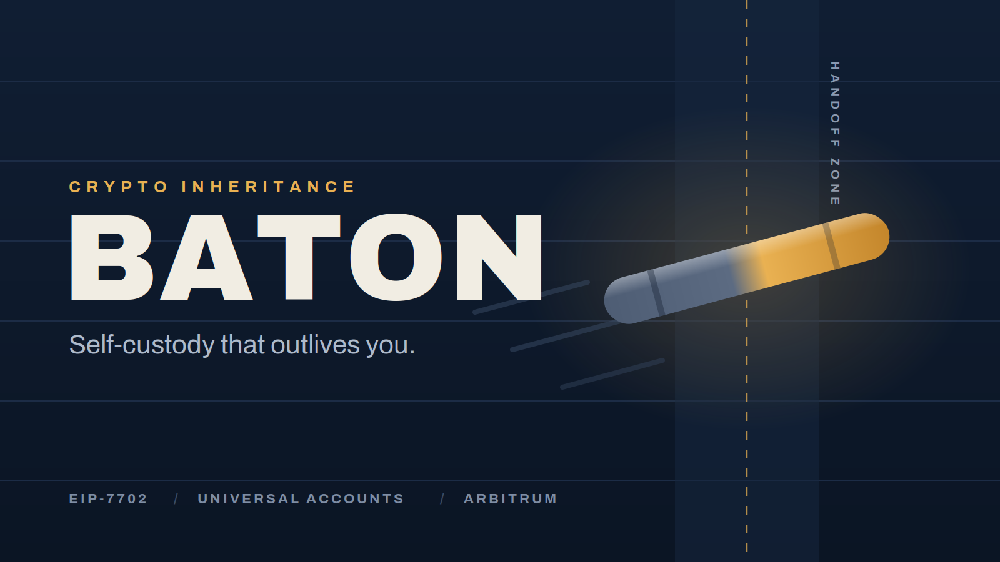

<p align="center">
  
</p>

# Baton

**Self custody that outlives you.**

Crypto gives complete ownership while you are alive and almost no usable handover when you are gone. Analysts estimate millions of BTC, worth hundreds of billions of dollars, are permanently inaccessible, with owners dying without passing on access among the leading causes. Baton fixes the handover.

Baton is a revocable onchain estate. Place assets in it, name your beneficiaries, and confirm you are active with a periodic heartbeat. If you go silent past your heartbeat interval and grace period, the estate unlocks and the people you chose claim their share by signing in with the email they already have. No seed phrases. No bridges. No gas purchases. No crypto knowledge required to inherit.

Built solo for the UXmaxx Hackathon 2026.

## Links

| What | Where |
| --- | --- |
| Live app | https://batonhq.vercel.app |
| Pitch deck (10 slides) | https://batonhq.vercel.app/pitch |
| Documentation | https://batonhq.vercel.app/docs |
| Demo video | ADD_YOUTUBE_LINK_HERE |
| BatonEstate contract | https://sepolia.arbiscan.io/address/0x26134528c56099B50Cf29af629389d1DCb192334 |
| MockUSDC contract | https://sepolia.arbiscan.io/address/0xb0BA9513cfbfad27EA231e0a9EdA4142CE548B7E |

## How it works

1. **Create.** Sign in with Magic (email OTP, wallet created silently). Name up to three beneficiaries with percentage shares, set your heartbeat interval and grace period, optionally set a guardian. A random claim secret is generated per beneficiary in your browser; only its keccak256 hash goes onchain.
2. **Fund.** Deposit ETH and tokens. The estate is fully revocable: withdraw anything or cancel entirely at any time before activation.
3. **Carry.** Press "Keep carrying the baton" to reset your clock. Production intervals are months; Demo Mode compresses to 2 minutes + 1 minute grace so the full lifecycle can be watched live.
4. **Pass.** After the clock and grace period lapse, anyone can activate the estate (or only the guardian, if set). Balances snapshot so claim order cannot change shares.
5. **Receive.** Each beneficiary opens their claim link, signs in with their own email, and accepts. Magic creates their wallet on the spot, the app sponsors their gas invisibly, and the contract pays out their percentage.

## Deployed contracts (Arbitrum Sepolia, chain id 421614)

| Contract | Address |
| --- | --- |
| BatonEstate | [`0x26134528c56099B50Cf29af629389d1DCb192334`](https://sepolia.arbiscan.io/address/0x26134528c56099B50Cf29af629389d1DCb192334) |
| MockUSDC (test asset, open faucet) | [`0xb0BA9513cfbfad27EA231e0a9EdA4142CE548B7E`](https://sepolia.arbiscan.io/address/0xb0BA9513cfbfad27EA231e0a9EdA4142CE548B7E) |

## Architecture

```
contracts/            Foundry project
  src/BatonEstate.sol   estates, heartbeats, guardians, commitments, claims
  src/MockUSDC.sol      6-decimal test token with open faucet
  test/                 20 tests covering the full lifecycle

baton-app/            Next.js 14 app
  app/page.tsx          landing + Magic email sign in
  app/dashboard/        owner: create, fund, heartbeat, links, revoke
  app/claim/            beneficiary: sign in, sponsored gas, accept
  app/api/gas/          server route sponsoring heir gas (testnet convenience)
  app/docs              documentation with sidebar navigation
  app/pitch             10 slide pitch deck
```

**Contract design.** Beneficiaries are stored as keccak256 commitments of claim secrets with shares in basis points totalling 10,000. Expiry is `lastHeartbeat + interval + grace` judged by block time, so no server or cron is trusted. Activation snapshots balances; `claim(estateId, index, secret)` pays the share of the snapshot to `msg.sender` when the secret matches, binding the heir wallet at claim time (heirs are named by email, so their address cannot be known in advance). Withdraw and cancel work any time before activation, never after. All value paths are reentrancy guarded.

**Privacy.** Nothing personal touches the chain. Names and emails stay in the owner's browser. Onchain: hashes, percentages, timestamps, balances.

**Walletless UX.** Magic embedded wallets on both sides (email OTP, no seed phrase step). The claim page silently tops up the heir wallet with gas through a server route before the accept press, so a first-time user inherits without knowing gas exists.

## Run locally

```bash
# contracts
forge install foundry-rs/forge-std
forge test                          # 20 passing

# app
cd baton-app
npm install
# create .env.local with the values below
npm run dev                         # http://localhost:3000
```

`.env.local`:

```
NEXT_PUBLIC_MAGIC_KEY=pk_live_...   # Magic publishable key (dashboard.magic.link)
PK=0x...                            # testnet sponsor key for heir gas (server side only)
RPC=https://sepolia-rollup.arbitrum.io/rpc
```

The owner's Magic wallet needs a little Arbitrum Sepolia ETH for gas. Test mUSDC comes from the in-app faucet button.

## Demo flow (3 minutes in Demo Mode)

Create estate with Demo Mode on, deposit ETH and mUSDC, press the heartbeat once, copy the claim link, then stop. The countdown dies, the status flips to Ready to pass, and the claim link (opened in incognito with a different email) walks through sign in, sponsored gas, and Accept the Baton, ending with assets in a wallet that did not exist two minutes earlier.

## Security model and honest limitations

The owner is protected by layers: full revocability before activation, the grace period, the ability to heartbeat back even after expiry (right up until activation), and an optional guardian who must confirm before claims open. Baton can only ever distribute what was explicitly deposited.

Prototype limitations, stated plainly: testnet assets only; claim links are bearer secrets (production adds verified beneficiary identity and guardian co-signing); gas sponsorship is an app route (production: account abstraction paymasters); no audit yet; Baton complements a legal will, it does not replace one.

## Roadmap

Mainnet with audited contracts. Cross-chain estate funding through chain abstraction so one tap gathers assets from every chain into the reserve. Verified beneficiary identity and notifications. Guardian co-signing on claims. Integrations with the legal estate world.

---

**Carry it. Protect it. Pass it on.**
